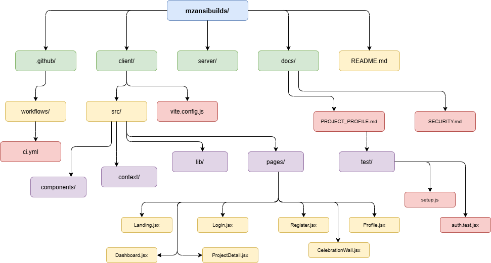

# MzansiBuilds

> A platform for South African developers to **build in public** — share projects, track progress, and connect with collaborators.


## Overview

MzansiBuilds is a real-time developer community platform where developers across Mzansi can:

- Share what they're building with the community
- Track and update project progress with milestones
- Comment on and collaborate with other developers
- Get celebrated on the Celebration Wall when they ship

## Tech Stack

| Layer    | Technology     | Reason                              |
| -------- | -------------- | ----------------------------------- |
| Frontend | React + Vite   | Fast, component-based UI            |
| Styling  | Tailwind CSS   | Utility-first, consistent design    |
| Backend  | Supabase       | Auth, PostgreSQL, Realtime, Storage |
| Testing  | Vitest         | Fast unit testing for Vite projects |
| CI/CD    | GitHub Actions | Automated build and test pipeline   |

## Getting Started

### Prerequisites

- Node.js v20+
- npm
- Supabase account

### Installation

```bash
# Clone the repo
git clone https://github.com/SkhumbuzoMkize/mzansibuilds.git
cd mzansibuilds

# Install frontend dependencies
cd client && npm install

# Install backend dependencies
cd ../server && npm install
```

### Environment Variables

Create `client/.env`:

```env
VITE_SUPABASE_URL=your_supabase_url
VITE_SUPABASE_ANON_KEY=your_supabase_anon_key
```

### Running the App

```bash
cd client
npm run dev
```

Open `http://localhost:5173`

### Running Tests

```bash
cd client
npm test -- --run
```

## Project Structure

<div align="center">

| Project Structure                                       |
| ------------------------------------------------------- |
|  |

</div>

## Architecture

<div align="center">

| System Architecture                                         |
| ----------------------------------------------------------- |
|  |

</div>

## Database Schema

<div align="center">

| Database Schema                                     |
| --------------------------------------------------- |
|  |

</div>

## Features

### Developer Feed

Real-time feed showing all projects being built. Filter by All, Following, or Seeking Collab.

### Project Management

Create projects with title, description, stage, tech stack and progress tracking. Add milestones and update them as you go.

### Collaboration

Raise your hand on any project to request collaboration. Project owners can see who wants to collaborate.

### Celebration Wall

When a project is marked as Completed, it automatically appears on the Celebration Wall.

### Profile Management

Each developer has a profile with avatar, bio, and a grid of their projects.

## Documentation

- [Project Profile & UML](./docs/PROJECT_PROFILE.md)
- [Security Documentation](./docs/SECURITY.md)

## CI/CD Pipeline

Every push to `main` triggers:

1. Install dependencies
2. Build the frontend
3. Run all unit tests

## Author

**Skhumbuzo Mkize** — Derivco Graduate Programme 2026

---

_Durban, South Africa_
