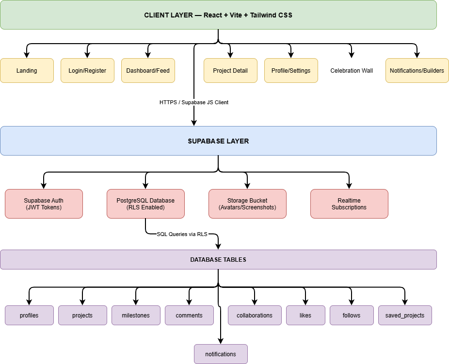
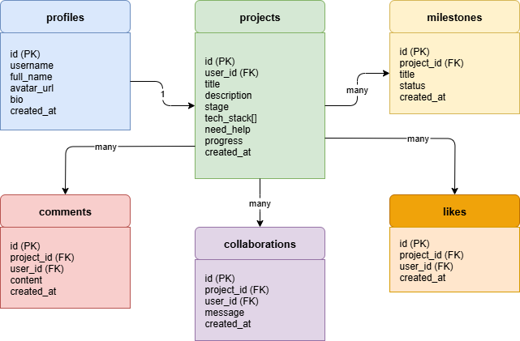

# MzansiBuilds — Project Profile

## Project Overview

MzansiBuilds is a social platform for South African developers to build in public,
share progress, and find collaborators.

## Problem Statement

South African developers often build in isolation with no visibility into what
others are working on, making it hard to find collaborators or get feedback.

## Solution

A real-time developer feed platform where developers can:

- Share projects and track progress publicly
- Comment and collaborate with other developers
- Celebrate completed projects on a Celebration Wall

## Requirements Analysis

### Functional Requirements

| ID  | Requirement                                       |
| --- | ------------------------------------------------- |
| FR1 | Users can register and manage their account       |
| FR2 | Users can create and manage projects              |
| FR3 | Users can view a live feed of all projects        |
| FR4 | Users can comment on and like projects            |
| FR5 | Users can raise a hand for collaboration          |
| FR6 | Users can update project milestones               |
| FR7 | Completed projects appear on the Celebration Wall |

### Non-Functional Requirements

| ID   | Requirement                                        |
| ---- | -------------------------------------------------- |
| NFR1 | Application must load within 3 seconds             |
| NFR2 | All user data must be secured with RLS policies    |
| NFR3 | Application must be responsive on all screen sizes |
| NFR4 | Code must be maintainable and well documented      |

## System Architecture

| System Architecture                                    |
| ------------------------------------------------------ |
|  |

## Database Schema (UML)

| Database Schema                                |
| ---------------------------------------------- |
|  |

## Tech Stack Justification

| Technology   | Reason                                               |
| ------------ | ---------------------------------------------------- |
| React + Vite | Fast, component-based UI with hot module reloading   |
| Tailwind CSS | Utility-first CSS for rapid, consistent styling      |
| Supabase     | Provides auth, PostgreSQL DB, storage and realtime   |
| Node.js      | JavaScript runtime consistent with frontend language |

## Development Methodology

Agile approach with iterative development:

- Sprint 1: Project setup, auth, database schema
- Sprint 2: Core features - feed, projects, comments
- Sprint 3: Profile, Celebration Wall, milestones
- Sprint 4: Testing, security, documentation

## Author

**Skhumbuzo Mkize** — Derivco Graduate Programme 2026
